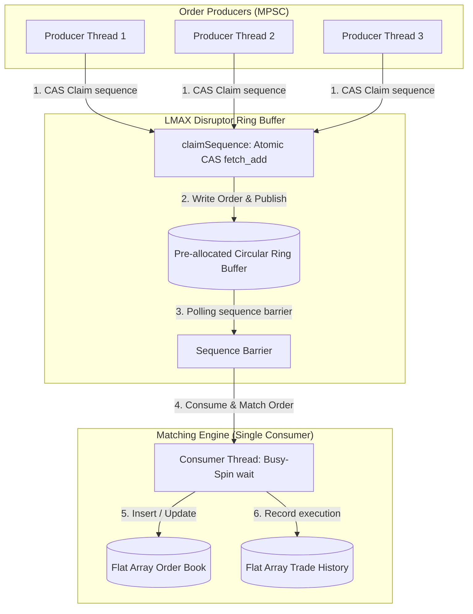

# Low-Latency C++ Order Book & Matching Engine Simulator

A high-performance, single-file C++ matching engine simulator demonstrating ultra-low latency design patterns and hardware-level CPU optimizations. This project serves as an educational reference validating the findings of the HFT research paper *C++ Design Patterns for Low-Latency Applications*.

---

## 🚀 Quick Start (Under 2 Minutes)

Get the project compiled and running on your local machine.

### **Prerequisites**
*   **MinGW / GCC** (GCC 6.3.0 or higher) with AVX2 instruction support.
*   **Windows / Linux / macOS** host environment.

### **Compilation & Run**
Compile with aggressive optimization flags (`-O3`) and enable AVX2 vector instructions:

```powershell
# Compile the C++ source code
g++ -O3 -std=c++17 -mavx2 matching_engine.cpp -o matching_engine.exe

# Execute the simulator and run the built-in benchmarks
.\matching_engine.exe
```

---

## 📊 Performance Benchmark Results

These benchmarks were run locally on an Intel AVX2-compatible CPU, comparing optimized techniques directly against standard C++ implementations:

| Benchmark Scenario | Avg Latency (ns) | Avg CPU Cycles | Speedup | Explanation |
| :--- | :---: | :---: | :---: | :--- |
| **VWAP Stats: Baseline Loop** | 720.44 ns | 1518 | *Baseline* | Sequential in-memory loop calculating weighted price-volumes. |
| **VWAP Stats: AVX2 SIMD** | 33.52 ns | 63 | **21.5x** | Parallel vectorized calculations via YMM registers. |
| **Data Types: Mixed Promotion** | 1,386,243.20 ns | 2,927,786 | *Baseline* | Jitter caused by promoting float variables to double literals. |
| **Data Types: Consistent Float** | 13,828.90 ns | 29,973 | **100.2x** | Strict single-precision float operations using `f` suffixes. |
| **Pipeline: Mutex Queue** | 360.75 ns | 748 | *Baseline* | Standard queue guarded by `std::mutex` and thread context switches. |
| **Pipeline: Lock-Free Disruptor** | 106.17 ns | 222 | **3.4x** | Pre-allocated lock-free Ring Buffer and busy-spin strategy. |

---

## 🛠️ Architecture & Design Choices



### **1. Flat, Contiguous Memory Layout (ADR-0001)**
*   **The Problem:** Dynamic allocations (`std::vector::push_back`, `new`, `std::map`) cause heap fragmentation and page faults, leading to massive latency spikes (jitter).
*   **The Design:** Active orders and trades are stored in flat, pre-allocated contiguous memory pools (`MAX_ORDERS = 100,000`). Bids and asks are managed in flat arrays of size `MAX_DEPTH = 100`. Traversing flat arrays is linear and extremely cache-friendly.
*   **Struct Padding:** The `Order` struct is explicitly padded to 32 bytes to align cleanly with CPU cache boundaries.

### **2. MPSC Lock-Free Circular Ring Buffer (ADR-0002)**
*   **The Problem:** Standard queues protected by mutexes force the operating system to suspend and wake threads, causing context-switch overhead that takes up to 3000ns per transaction.
*   **The Design:** Employs the **LMAX Disruptor Pattern** utilizing a circular buffer of size `4096`. 
    *   **Producers:** Race to claim slots concurrently using atomic `fetch_add` (Compare-And-Swap/CAS) on `claimSequence`.
    *   **Consumer:** The matching engine thread runs in a **Busy-Spin Strategy**, polling sequence numbers using atomic release-acquire semantics. This keeps thread execution entirely in user-space, achieving sub-microsecond latency.
    *   **False Sharing Prevention:** Core atomic counters (`claimSequence` and `consumerSequence`) are decorated with `alignas(64)` to ensure they sit on separate cache lines, eliminating cache line bouncing.

### **3. AVX2 SIMD Statistics Calculation (ADR-0003)**
*   **The Problem:** Calculating statistical metrics like VWAP (Volume-Weighted Average Price) sequentially over book levels scales linearly with depth, wasting clock cycles.
*   **The Design:** Using Intel AVX2 vector intrinsics, 8 price levels are loaded into a single 256-bit register (`YMM`) and processed in parallel. 
    *   `_mm256_loadu_si256`: Loads 8 levels of prices and volumes simultaneously.
    *   `_mm256_cvtepi32_ps`: Converts integers to floats in parallel.
    *   `_mm256_mul_ps`: Multiplies prices * volumes across 8 lanes in a single clock cycle.

```
AVX2 Register Layout:
[ Price 0 | Price 1 | Price 2 | Price 3 | Price 4 | Price 5 | Price 6 | Price 7 ] (YMM Prices)
                                   x  (Parallel multiply in 1 cycle)
[ Vol 0   | Vol 1   | Vol 2   | Vol 3   | Vol 4   | Vol 5   | Vol 6   | Vol 7   ] (YMM Volumes)
                                   =
[ Prod 0  | Prod 1  | Prod 2  | Prod 3  | Prod 4  | Prod 5  | Prod 6  | Prod 7  ] (YMM Products)
```

### **4. Slowpath Isolation & Compiler Hints**
*   **The Design:** Error checks and logging are moved outside the critical loop to `[[noinline]]` helper functions (like `log_order_rejection`). This ensures that cold error-handling instructions do not pollute the CPU L1 Instruction Cache (I-cache), keeping the core matching loop compact.

### **5. Type Consistency**
*   **The Design:** Eliminates implicit compiler promotions by ensuring all float calculations use single-precision literals (e.g. `1.23f` instead of `1.23`). This prevents the CPU from performing expensive conversion cycles.

---

## 📂 Project Structure

```
paper-implementations/
├── CONTEXT.md             # Ubiquitous domain glossary
├── docs/
│   └── adr/              # Architectural Decision Records
│       ├── 0001-fixed-capacity-and-flat-memory.md
│       ├── 0002-concurrency-and-disruptor-pipeline.md
│       ├── 0003-cpu-level-micro-optimizations.md
│       └── 0004-custom-benchmarking-harness.md
├── matching_engine.cpp    # Single-file simulator & benchmark harness
└── README.md              # Project documentation and results
```
